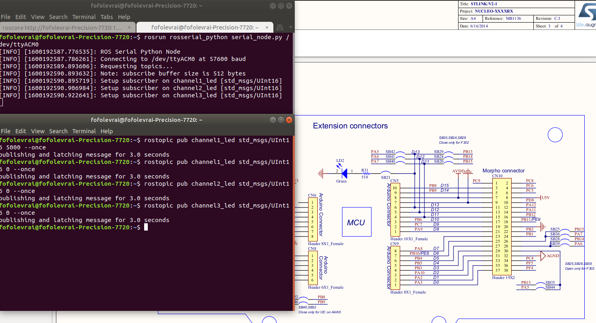

# Blinking LED

This example shows how to use subcriber with rosserial_stm32. From a command client, the user can manage duty cycle LEDs by sending commands over rosserial.

This example has been tested on:

* [Nucleo-F303K8(STM32F303)](http://www.st.com/en/evaluation-tools/nucleo-f303k8.html)
* [Nucleo-F401RE(STM32F401RE)](https://www.st.com/en/evaluation-tools/nucleo-f401re.html)

## Getting Started

Nowasdays, robots are composed of multiple CPUs which need to communicate to sychnronized and perform actions in real-time. Easing software development, ROSserial protocol set-up a commun data transfer interface between CPU(s) which act, as ROS node(s).
[rosserial_stm32](https://github.com/yoneken/rosserial_stm32)'s author has been porting rosserial package onto STM32 microchips.

## Used peripherals

- USART2 (through DMA)
- Timer1
- Timer2

## Prerequisites

This whole example depends on folllowing packages and tools:
* [STM32CubeIDE](https://www.st.com/en/development-tools/stm32cubeide.html) or [STM32CubeMX](http://www.st.com/en/development-tools/stm32cubemx.html)
* [ROS](https://www.ros.org/)
* [rosserial](http://wiki.ros.org/rosserial)
* [rosserial_stm32](https://github.com/yoneken/rosserial_stm32)

## Installation

If not done, install prerequired dependencies.

### ROS installation

Please, report to [ROS installation page](http://wiki.ros.org/melodic/Installation/Ubuntu)

### STM32CubeIDE installation

* Download [STM32CubeIDE from ST website](https://www.st.com/en/development-tools/stm32cubeide.html)

* From your download repository, open up a console and run below command to unzip the downloaded file

```
unzip {FILE_NAME.zip}
```

* Run the bash script with executuion priviledge and let you guide by the installation setup.

```
chmod +x {FILE_NAME.sh}
sh {FILE_NAME.sh}
```

*Press 'Q' character to skip software compliance*

### ROSserial installation

From your console, run the following commands:
```
sudo apt update
sudo apt-get install ros-melodic-rosserial
```


### ROSserial_stm32 installation

* Clone [rosserial_stm32](https://github.com/yoneken/rosserial_stm32) repository:

```
git clone https://github.com/yoneken/rosserial_stm32
```


* Build the project (not checked)
```
make install
```

* Copy package path folder to your ROS setup
```
echo "[ABSOLUT_PATH_TO_ROSSERIAL_STM32_FOLDER]/rosserial_stm32/src/rosserial_stm32
" >> ~/.bashrc
source ~/.bashrc
```
## Wiring

### NUCLEO-F303K8

|Name    |Nucleo board|STM32F303(LQFP32)|LED  |
|--------|------------|-----------------|-----|
|Vin (5V)|CN4-P4      |                 |     |
|GND     |CN4-P2      |VSS(16, 32)      |GND  |
|LED1    |CN3-P12     |PA8(18)          |LED1 |
|LED2    |CN3-P1      |PA9(19)          |LED2 |
|LED3    |CN3-P2      |PA10(20)         |LED3 |


### NUCLEO-F401RE

|Name    |Nucleo board|STM32F401(LQFP32)|LED  |
|--------|------------|-----------------|-----|
|GND     |CN6         |                 |GND  |
|LED1    |CN9-D7      |PA8              |LED1 |
|LED2    |CN5-D8      |PA9              |LED2 |
|LED3    |CN9-D2      |PA10             |LED3 |

***Wire respectively D8, D7, D3 nucleo pins with a serial 150 ohm resistance follow up by a LED. Ground all to GND on CN6 connector.***

## Running the code

* Flash and run the target from STM32CubeIDE
* Launch ROS server:
```
roscore
```
* Launch the client serial node from an other terminal:
```
rosrun rosserial_python serial_node.py /dev/ttyACM0
```
* From an other terminal, push your command with the following line:
```
rostopic pub channel1_led std_msgs/UInt16 5000 --once
```
For channel 2 (second LED):
```
rostopic pub channel2_led std_msgs/UInt16 9000 --once
```
**The value manages LEDs duty cycle. It should be comprised between 0 (LED off) and 9999 (LED fully on)**

## Outputs

You should see the following console outputs:



## License

This project is licensed under the BSD License - see the [LICENSE.md](LICENSE.md) file for details