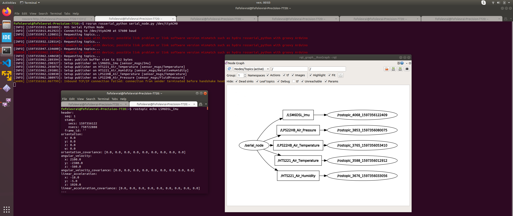

# MULTI-PUBLISHERS ENVIRONNEMENT & MOTION SENSING

This project is a mullti-nodes publishers example using ST demonstration shield [X-NUCLEO-IKS01A2](https://www.st.com/content/st_com/en/products/ecosystems/stm32-open-development-environment/stm32-nucleo-expansion-boards/stm32-ode-sense-hw/x-nucleo-iks01a2.html) which combined:
-   [LPS22HB](https://www.st.com/en/mems-and-sensors/lps22hb.html#overview) : A temperature and pressure sensor.
-   [HTS221](https://www.st.com/en/mems-and-sensors/hts221.html) : A temperature and humidity sensor.
-   [LSM303AGR](https://www.st.com/en/mems-and-sensors/lsm303agr.html) : A 3D magnetic and accelerometer sensor.
-   [LSM6DSL](https://www.st.com/en/mems-and-sensors/lsm6dsl.html/) : A 6DOF inertia sensor.

Project has been configured with STM32CubeIDE on [NUCLEO-F401RE](https://www.st.com/content/st_com/en/products/evaluation-tools/product-evaluation-tools/mcu-mpu-eval-tools/stm32-mcu-mpu-eval-tools/stm32-nucleo-boards/nucleo-f401re.html) using given ST BSP (Board Support Package) easing sensor data retrieval. Therefore, C++ ROS calls have been wrappered to be direcly used in the C application.

## Context

Nowasdays, robots are composed of multiple CPUs which need to communicate to sychnronized and perform actions in real-time. Easing software development, ROSserial protocol set-up a commun data transfer interface between CPUs which act, as a ROS node.
[rosserial_stm32](https://github.com/yoneken/rosserial_stm32)'s author has been porting rosserial package onto STM32 microchips but STMCubeMX configuration needs to be re-imported into STMCubeIDE. Thus, this fork example is a turnkey solution for STM32CubeIDE.

## Prerequisites

### Hardware

* [NUCLEO-F401RE](https://www.st.com/content/st_com/en/products/evaluation-tools/product-evaluation-tools/mcu-mpu-eval-tools/stm32-mcu-mpu-eval-tools/stm32-nucleo-boards/nucleo-f401re.html)
* [X-NUCLEO-IKS01A2](https://www.st.com/content/st_com/en/products/ecosystems/stm32-open-development-environment/stm32-nucleo-expansion-boards/stm32-ode-sense-hw/x-nucleo-iks01a2.html) shield

### Software

This whole example depends on folllowing packages and tools:
* [STM32CubeIDE](https://www.st.com/en/development-tools/stm32cubeide.html) 
* [ROS](https://www.ros.org/)
* [rosserial](http://wiki.ros.org/rosserial)
* [rosserial_stm32](https://github.com/yoneken/rosserial_stm32)

## SETUP

If not done, install prerequired dependencies.

### ROS installation

Please, report to [ROS installation page](http://wiki.ros.org/melodic/Installation/Ubuntu)

### STM32CubeIDE installation

* Download [STM32CubeIDE from ST website](https://www.st.com/en/development-tools/stm32cubeide.html)

* From your download repository, open up a console and run below command to unzip the downloaded file

```
unzip {FILE_NAME.zip}
```

* Run the bash script with executuion priviledge and let you guide by the installation setup.

```
chmod +x {FILE_NAME.sh}
sh {FILE_NAME.sh}
```

*Press 'Q' character to skip software compliance*

### ROSserial installation

From your console, run the following commands:


```
sudo apt update
sudo apt-get install ros-melodic-rosserial
```

### ROSserial_stm32 installation

* Clone [rosserial_stm32](https://github.com/yoneken/rosserial_stm32) repository:
```
git clone https://github.com/yoneken/rosserial_stm32
```

* Build the project (not checked)
```
make install
```

* Copy package path folder to your ROS setup
```
echo "[ABSOLUT_PATH_TO_ROSSERIAL_STM32_FOLDER]/rosserial_stm32/src/rosserial_stm32
" >> ~/.bashrc
source ~/.bashrc
```

## RUNNING THE CODE


* Open the project with [STM32CubeIDE](https://www.st.com/en/development-tools/stm32cubeide.html), compile it and flash the Nucleo target

* From your terminal, get the serial port where your NUCLEO is connected using *dmesg*

```
dmesg | grep tty
```

* Then, run the rosserial service :

```
rosrun rosserial_python serial_node.py /dev/ttyACM0
```

* In a second one, listen the pressure topic :
```
rostopic echo LPS22HB_Air_Pressure
```
* In the third one, listen the temperature topic :
```
rostopic echo LPS22HB_Air_Temperature
```
You should get the following output :



## DIVING INTO THE CODE

The current code is a forked implementation of ST [DataLogTerminal](https://www.st.com/content/st_com/en/products/embedded-software/mcu-mpu-embedded-software/stm32-embedded-software/stm32cube-expansion-packages/x-cube-mems1.html) software example. However, unlike original source code, sensor data are not send to serial console but over standardized ROS messages to rosserial_python client.

In this current project, the C++ ROS code has been wrapped to be used directly from the original C code. That's why, for each [sensor components](Drivers/BSP/Components), you will find a ros folder with the following files:
*   SENSORNAME_rosService.h : A singleton class managing gathering and publishing data
*   SENSORNAME_rosWrapper.h : Wrap C++ implementation of "SENSORNAME_rosService"

Those classes are using a ROS serial intance which access a unique ROSserial instance.


## ISSUES

* **Issue1:** ROS serial python node isn't able to sychronize with ST device due to speed rate. Adding a delay in negotiateTopics() function (file: node_handle.h) seems to resolve the issue.
* **Issue2:** Over publishing could raise a "checksum" issue on rosserial client. However, you can manage the publisher number (and thus published data throughput) at compile time by setting or desabling "USE_IKS01A2" defines present in [iks01a2_conf.h](MEMS/Target/iks01a2_conf.h#L33).


## LICENSE

This project is licensed under the BSD License - see the [LICENSE.md](LICENSE.md) file for details