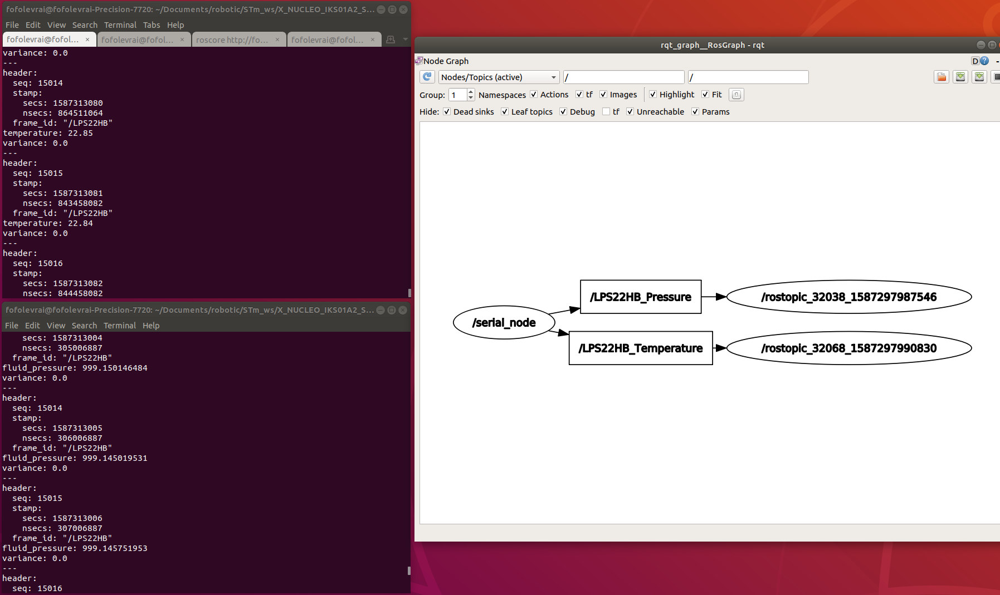

# LPS22HB PRESSURE & TEMPERATURE SENSING

This project is a simple two nodes example publishing [LPS22HB sensor](https://www.st.com/en/mems-and-sensors/lps22hb.html#overview) temperature and pressure build on the [X-NUCLEO-IKS01A2](https://www.st.com/content/st_com/en/products/ecosystems/stm32-open-development-environment/stm32-nucleo-expansion-boards/stm32-ode-sense-hw/x-nucleo-iks01a2.html#overview)  nucleo shield from ST.

## Context

Nowasdays, robots are composed of multiple CPUs which need to communicate to sychnronized and perform actions in real-time. Easing software development, ROSserial protocol set-up a commun data transfer interface between CPUs which act, as a ROS node.
[rosserial_stm32](https://github.com/yoneken/rosserial_stm32)'s author has ported *rosserial package* onto STM32 controllers. The current example shows how to retrieve sensor data and send over serial.

## Prerequisites

### Hardware

* [NUCLEO-F401RE](https://www.st.com/content/st_com/en/products/evaluation-tools/product-evaluation-tools/mcu-mpu-eval-tools/stm32-mcu-mpu-eval-tools/stm32-nucleo-boards/nucleo-f401re.html)
* [X-NUCLEO-IKS01A2](https://www.st.com/content/st_com/en/products/ecosystems/stm32-open-development-environment/stm32-nucleo-expansion-boards/stm32-ode-sense-hw/x-nucleo-iks01a2.html) shield

### Software

This whole example depends on folllowing packages and tools:
* [STM32CubeIDE](https://www.st.com/en/development-tools/stm32cubeide.html) : The ST microlectronics IDE which embedded 
* [ROS](https://www.ros.org/)
* [rosserial](http://wiki.ros.org/rosserial)
* [rosserial_stm32](https://github.com/yoneken/rosserial_stm32)

## SETUP

If not done, install prerequired dependencies.

### ROS installation

Please, report to [ROS installation page](http://wiki.ros.org/melodic/Installation/Ubuntu)

### STM32CubeIDE installation

* Download [STM32CubeIDE from ST website](https://www.st.com/en/development-tools/stm32cubeide.html)

* From your download repository, open up a console and run below command to unzip the downloaded file

```
unzip {FILE_NAME.zip}
```

* Run the bash script with executuion priviledge and let you guide by the installation setup.

```
chmod +x {FILE_NAME.sh}
sh {FILE_NAME.sh}
```

*Press 'Q' character to skip software compliance*

### ROSserial installation

From your console, run the following commands:


```
sudo apt update
sudo apt-get install ros-melodic-rosserial
```
**Note: Replace _melodic_ by your ROS distribution**

### ROSserial_stm32 installation

* Clone [rosserial_stm32](https://github.com/yoneken/rosserial_stm32) repository:
```
git clone https://github.com/yoneken/rosserial_stm32
```

* Build the project (not checked)
```
make install
```

* Copy package path folder to your ROS setup
```
echo "[ABSOLUT_PATH_TO_ROSSERIAL_STM32_FOLDER]/rosserial_stm32/src/rosserial_stm32
" >> ~/.bashrc
source ~/.bashrc
```

## Get started

* Open the project with [STM32CubeIDE](https://www.st.com/en/development-tools/stm32cubeide.html), compile it and flash the Nucleo target

* Get the serial port where your NUCLEO is connected using *dmesg*

```
dmesg | grep tty
```

* In a terminal, run the rosserial service :

```
rosrun rosserial_python serial_node.py /dev/ttyACM0
```
**Note: Replace _ttyACM0_ by your serial port**

* In a second one, listen the pressure topic :
```
rostopic echo LPS22HB_Pressure
```
* In the third one, listen the temperature topic :
```
rostopic echo LPS22HB_Temperature
```
You should get the following output :



## License

This project is licensed under the BSD License - see the [LICENSE.md](LICENSE.md) file for details